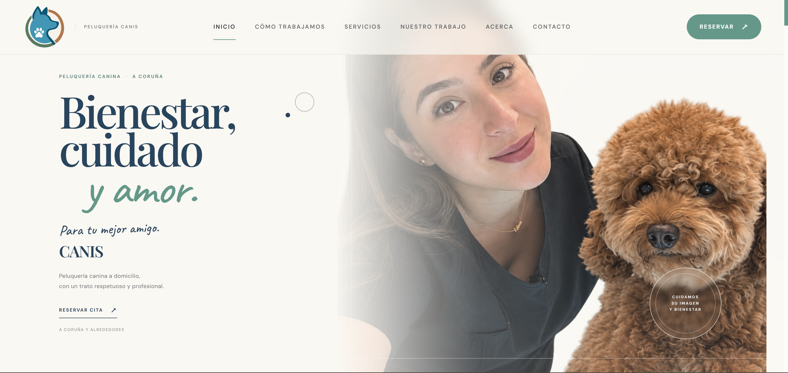
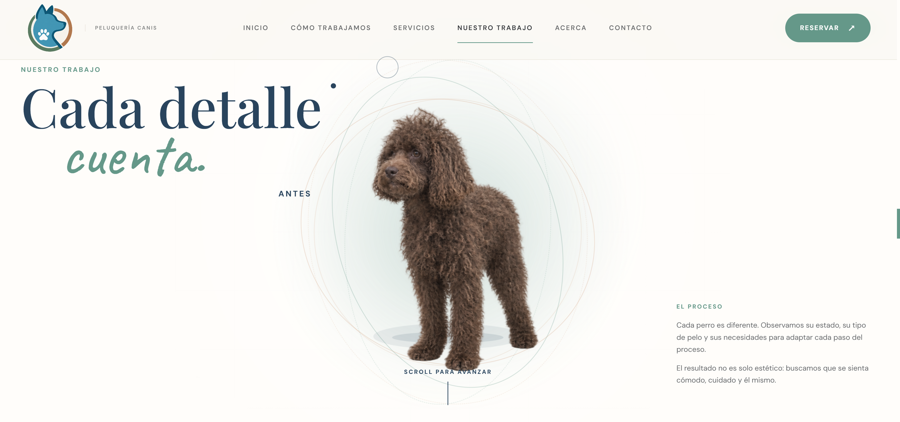
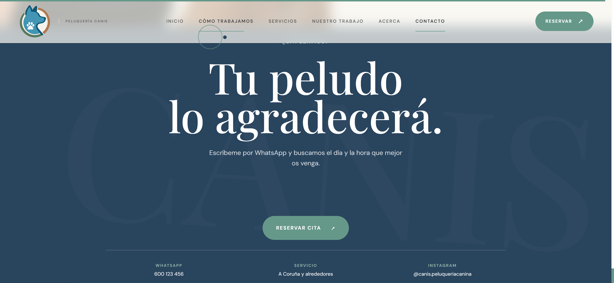

# CANIS — Dog Grooming Website

Personal project showcasing UX/UI design and responsive web development for a dog grooming brand.

## Preview

## Overview

CANIS is a modern website concept created for a dog grooming business, with a focus on creating a friendly, clear and approachable user experience.

The design combines a clean visual identity with intuitive navigation and responsive layouts to make the website easy to use across different devices.

## Key Features

* Responsive design
* Modern and friendly visual identity
* Clear service presentation
* Intuitive navigation
* Interactive elements
* Mobile-friendly layout
* Focus on usability and user experience

## Technologies

* HTML
* CSS
* JavaScript

## Purpose

This project was created as a personal design and development exercise to explore UX/UI principles, responsive web design and the creation of a visual identity for a local service business.
